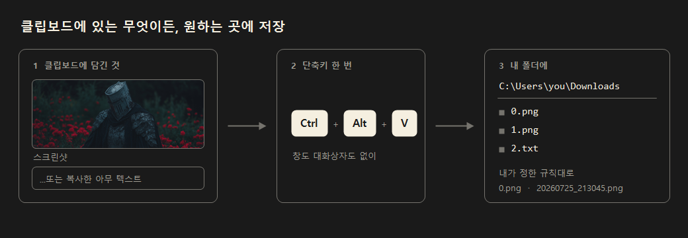

# EasyClipStash

[English](README.md) | **한국어**

[](https://github.com/JeongJongMun/EasyClipStash/actions/workflows/ci.yml)

클립보드에 있는 이미지나 텍스트를 단축키 한 번으로 원하는 폴더에 저장하는 윈도우 트레이 앱입니다.



## 왜 만들었나

깃허브 블로그에 글을 쓸 때마다 화면을 캡처하고, 그림판을 열어 붙여넣고, 폴더를 찾아 들어가서, 순서에 맞는 이름을 직접 붙여 저장하는 일을 반복하고 있었습니다. 여러 장을 다루다 보면 번호가 꼬이기도 했고요.

윈도우도 캡처한 화면은 자동으로 저장해 줍니다. 다만 이름이 항상 날짜와 시간이고, 캡처가 아니라 웹이나 메신저에서 복사한 이미지, 그리고 텍스트는 여전히 직접 붙여넣어 저장해야 합니다. 그래서 **클립보드에 담긴 것이라면 무엇이든 원하는 이름과 위치로 저장하는 것** 하나에 집중한 도구를 만들었습니다. 제가 쓰려고 시작했지만 같은 불편을 겪는 분이라면 그대로 쓰실 수 있습니다.

## 주요 기능

- **이미지와 텍스트 모두 저장** — 단축키를 누르면 클립보드를 확인해 이미지면 이미지로, 텍스트면 텍스트 파일로 저장합니다
- **파일 이름 자동 지정** — 번호를 매기거나 날짜와 시간을 붙이는 방식 중에서 고를 수 있고, 이미지와 텍스트에 서로 다른 규칙을 줄 수 있습니다
- **저장 위치 분리** — 이미지와 텍스트를 각각 다른 폴더에 저장할 수 있습니다
- **마크다운 태그 자동 복사** — 이미지를 저장하면 `` 같은 태그가 클립보드에 담겨 글에 바로 붙여넣을 수 있습니다
- **알림에서 바로 확인** — 저장 알림을 누르면 저장된 파일이 선택된 채로 탐색기가 열립니다
- **자동 업데이트** — 새 버전이 나오면 알려주고, 설정 창에서 버튼 한 번으로 업데이트합니다
- **한국어와 영어 지원**

## 이 도구가 하지 않는 것

"클립보드에 있는 것을 파일로 저장한다" 하나만 잘 하는 것이 목표이고, 범위를 좁게 유지하려 합니다. 다음은 계획에 없습니다.

- **화면 캡처 자체** — 윈도우의 `Win+Shift+S`를 그대로 씁니다
- **이미지 편집** — 자르기, 주석, 모자이크 등
- **화면 녹화**
- **업로드·클라우드 연동**
- **클립보드 기록 관리** — 윈도우의 `Win+V`를 쓰세요

## 설치

1. [최신 릴리스](https://github.com/JeongJongMun/EasyClipStash/releases/latest)에서 `EasyClipStash-win-x64.zip`을 내려받습니다
2. 원하는 폴더에 압축을 풉니다
3. `EasyClipStash.exe`를 실행합니다

설치 과정도, 별도의 런타임 설치도 필요하지 않습니다. 폴더를 지우면 그대로 삭제됩니다.

> 서명되지 않은 실행 파일이라 처음 실행할 때 윈도우에서 "PC 보호" 경고가 나타날 수 있습니다. **추가 정보 → 실행**을 눌러 진행하세요.

## 사용법

앱을 실행하면 창이 뜨지 않고 트레이 아이콘으로 들어갑니다.

1. 저장할 내용을 클립보드에 담습니다 (화면 캡처는 `Win+Shift+S`, 텍스트는 `Ctrl+C`)
2. **`Ctrl+Alt+V`** 를 누릅니다
3. 저장 완료 알림이 뜹니다. 알림을 누르면 저장된 위치가 열립니다

트레이 아이콘을 **더블클릭**하면 설정 창이 열리고, **우클릭**하면 메뉴가 나옵니다.

## 설정

설정 창은 네 가지 항목으로 나뉘어 있습니다.

| 항목 | 내용 |
|---|---|
| 기본 | 언어, 단축키, 업데이트 |
| 파일 이름 | 이미지와 텍스트 각각의 파일 이름 규칙 |
| 이미지 | 저장 위치, 이미지 형식(PNG/JPG), 마크다운 옵션 |
| 텍스트 | 저장 위치, 확장자(.txt/.md) |

### 파일 이름 규칙

| 방식 | 예시 | 설명 |
|---|---|---|
| 번호 매기기 | `0.png`, `1.png` | 폴더에서 가장 큰 번호를 찾아 다음 번호로 저장합니다 |
| 날짜_시간 | `20260724_213045.png` | 저장한 시각으로 이름을 만듭니다 |
| 날짜_순번 | `20260724_1.png` | 날짜 뒤에 번호가 붙고, 날짜가 바뀌면 1부터 다시 시작합니다 |

각 방식마다 시작 번호, 자릿수 맞추기, 날짜 형식 등을 고를 수 있고 이름 앞뒤에 원하는 말을 붙일 수도 있습니다.

### 기본값

| 설정 | 기본값 |
|---|---|
| 단축키 | `Ctrl+Alt+V` |
| 저장 위치 | 다운로드 폴더 |
| 파일 이름 | 번호 매기기 (0부터) |
| 이미지 형식 | PNG |
| 텍스트 확장자 | .txt |
| 언어 | English |

설정은 실행 파일과 같은 폴더의 `config.json`에 저장됩니다. 폴더를 통째로 옮기면 설정도 함께 따라갑니다.

## 자동 업데이트

시작할 때 새 버전이 있는지 확인하고, 있으면 알림으로 알려줍니다. 설정 창의 **기본** 항목에서 직접 확인할 수도 있습니다.

업데이트를 누르면 새 버전을 내려받아 SHA256 체크섬으로 검증한 뒤 교체하고 다시 시작합니다. 검증에 실패하면 설치하지 않습니다.

시작할 때 확인하는 동작은 설정에서 끌 수 있습니다.

## 빌드

.NET 10 SDK가 필요합니다.

```bash
dotnet build -c Release
```

배포용 단일 실행 파일:

```bash
dotnet publish -c Release -r win-x64 --self-contained true -p:PublishSingleFile=true -p:IncludeNativeLibrariesForSelfExtract=true -p:EnableCompressionInSingleFile=true -o publish
```

태그를 푸시하면 GitHub Actions가 빌드부터 릴리스 발행까지 자동으로 처리합니다.

```bash
git tag v1.0.0 && git push origin v1.0.0
```

## 라이선스

[MIT](LICENSE)
