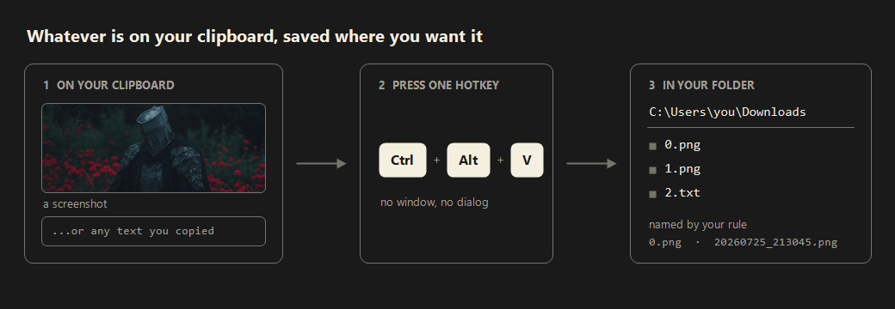

# EasyClipStash

**English** | [한국어](README.ko.md)

[](https://github.com/JeongJongMun/EasyClipStash/actions/workflows/ci.yml)

A Windows tray app that saves whatever is on your clipboard — an image or text — to the folder you choose, with a single hotkey.



## Why I built this

Every time I wrote a post for my GitHub blog, I went through the same routine: capture the screen, open Paint, paste, navigate to the right folder, and type a filename that continued the numbering. With several images in one post, the numbering would get out of order.

Windows does save your screen captures automatically. But the filename is always a timestamp, and anything that isn't a capture — an image copied from a website or a chat app, or a piece of text — still has to be pasted and saved by hand. So I built a tool focused on one thing: **saving whatever is on the clipboard, with the name and location you want.** I started it for myself, but if the same routine bothers you, it should work for you as well.

## Features

- **Saves both images and text** — press the hotkey and the app checks the clipboard: an image is saved as an image file, text as a text file
- **Automatic file naming** — number them sequentially or stamp them with the date and time, with separate rules for images and text
- **Separate destinations** — images and text can go to different folders
- **Markdown tag on the clipboard** — after saving an image, a tag like `` is placed on the clipboard, ready to paste into a post
- **Jump to the file** — click the save notification and Explorer opens with the saved file selected
- **Automatic updates** — the app tells you when a new version is out and updates itself from the settings window
- **English and Korean**

## What this tool does not do

The goal is to do one thing well — save what is on the clipboard to a file — and to keep the scope narrow. These are not planned:

- **Screen capture itself** — use the built-in `Win+Shift+S`
- **Image editing** — cropping, annotation, blurring
- **Screen recording**
- **Uploading or cloud integration**
- **Clipboard history** — use the built-in `Win+V`

## Installation

1. Download `EasyClipStash-win-x64.zip` from the [latest release](https://github.com/JeongJongMun/EasyClipStash/releases/latest)
2. Extract it to any folder
3. Run `EasyClipStash.exe`

There is no installer and no runtime to install. Deleting the folder removes the app completely.

> The executable is unsigned, so Windows may show a "protected your PC" warning the first time you run it. Click **More info → Run anyway**.

## Usage

The app has no main window; it lives in the system tray.

1. Put something on the clipboard (`Win+Shift+S` for a screen capture, `Ctrl+C` for text)
2. Press **`Ctrl+Alt+V`**
3. A notification confirms the save. Click it to open the file's location

**Double-click** the tray icon to open settings, **right-click** it for the menu.

## Settings

The settings window is split into four sections.

| Section | Contents |
|---|---|
| General | Language, hotkey, updates |
| File name | Naming rules for images and text, configured separately |
| Image | Save location, image format (PNG/JPG), markdown options |
| Text | Save location, extension (.txt/.md) |

### Naming rules

| Mode | Example | Description |
|---|---|---|
| Numbering | `0.png`, `1.png` | Finds the highest number in the folder and uses the next one |
| Date_Time | `20260724_213045.png` | Names the file after the moment it was saved |
| Date_Number | `20260724_1.png` | A counter after the date that restarts at 1 each day |

Each mode offers its own options — starting number, zero-padding, date format — and you can add your own text before or after the name.

### Defaults

| Setting | Default |
|---|---|
| Hotkey | `Ctrl+Alt+V` |
| Save location | Downloads folder |
| File name | Numbering (from 0) |
| Image format | PNG |
| Text extension | .txt |
| Language | English |

Settings are stored in `config.json` next to the executable. Move the folder and your settings travel with it.

## Automatic updates

On startup the app checks for a newer release and notifies you if one exists. You can also check manually under **General** in the settings window.

When you start an update, the app downloads the new version, verifies it against a SHA256 checksum, replaces itself, and restarts. If verification fails, nothing is installed.

The startup check can be turned off in settings.

## Building

Requires the .NET 10 SDK.

```bash
dotnet build -c Release
```

Single-file build for distribution:

```bash
dotnet publish -c Release -r win-x64 --self-contained true -p:PublishSingleFile=true -p:IncludeNativeLibrariesForSelfExtract=true -p:EnableCompressionInSingleFile=true -o publish
```

Pushing a tag makes GitHub Actions build and publish the release automatically.

```bash
git tag v1.0.0 && git push origin v1.0.0
```

## Contributing

Bug reports, ideas, and pull requests are welcome. See [CONTRIBUTING.md](CONTRIBUTING.md) for the development setup and conventions — and please check [what this tool does not do](#what-this-tool-does-not-do) before proposing a feature.

## License

[MIT](LICENSE)
